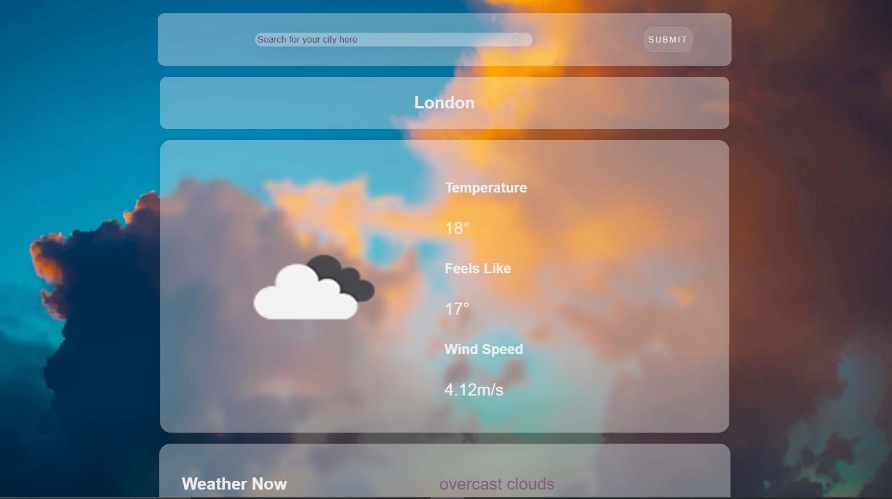
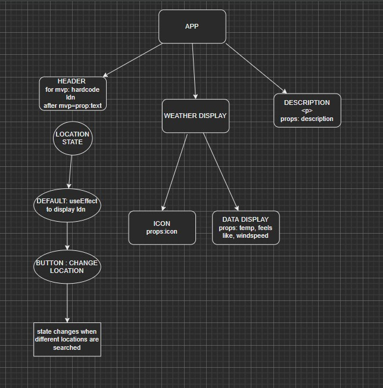

# React & TypeScript Hackathon - Weather App 🌩️

[Click here to see the Demo!](https://weather-app-typescript.netlify.app/)

## Brief

This project was part of The School of Code Hackathon. The goal was to build a weather app using Open Weather API & practice TypeScript in React.
For this project I was paired up with [@srai98i](https://github.com/srai98i) and [@Plume93](https://github.com/Plume93).

### Planning and documentation

We've come up with an MVP of the app that would fetch the weather of the input city, wind speed, whta it feels like and a matching icon from the API.
Drawing our component tree ensured that everyone was on the same page and provided a reference point for the App's software architecture.

## Functionality

At the moment the app takes input from the user, fetches data from the API and displays: 

- Chosen city 🌆
- Weather icon ⛅
- Temperature in Celcius 🌡️
- What the weather feels like in Celcius ❄️ 
- Wind speed 💨
- Weather description 🛰️

## Challenges

We faced a few challenges in this project:

- Empty dependency array in useEffect hook led to Open Weather blocking one of our teammate's account. We solved the problem by putting the Input City state in the depency array. 
- Using TypeScript made us more aware of the data types in props & gave more structure to the code. It was time consuming in the beginning but it got easier after reading TypeScript & looking at some code examples.
- Temperature fethced from the API was displayed in Kelvin & required converting to Celsius.

## Take Aways

In this project I've learned how powerful TypeScript is and the reason why it's so popular. 
Using TypeScript in React made me more conscious of the object structure & helped me to avoid some of the bugs with the help of TypeScript enabled IntelliSense in my code editor.

## Future Implementations

- Testing
- Login to enabled the user to save their location and display their local weather once they are logged in.
- Interactive wallpaper similar to Apple Weather

## Resources

- [Open Weather API](https://openweathermap.org/guide)
- [React/TypeScript cheat sheet](https://github.com/typescript-cheatsheets/react#reacttypescript-cheatsheets)
- [Example TypeScript app](https://github.com/JoselynDRF/react-redux-typescript-todolist)
